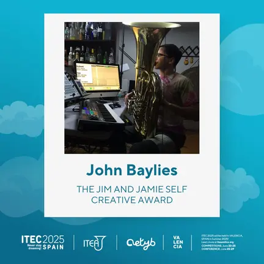
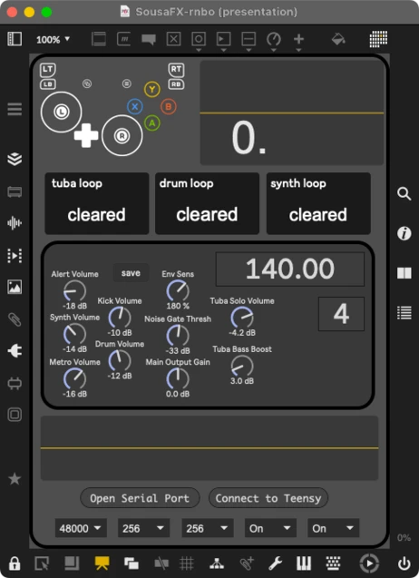

I'm honored to have received the [Jim and Jamie Self Creative Award](https://iteaonline.org/ac/itea-jim-and-jamie-self-creative-award/) for my work on [SousaFX](https://doc.sousastep.quest/)! 

Lately I've been porting SousaFX from [MaxMSP](https://cycling74.com/products/max) to [RNBO](https://cycling74.com/products/rnbo), which accomplishes a few things:

1. Reduces the [installation process](https://doc.sousastep.quest/content/install.html) from 16 steps to just a few steps.
2. Reduces the startup time from minutes to seconds.
3. Allows SousaFX to run on a [raspberry pi](https://rnbo.cycling74.com/learn/raspberry-pi-target-overview).

The UI has been rebuilt as a single window, and the controller bindings are set in stone, with only a handful of essential parameters revealed.

SousaFX-rnbo's [first outing](https://www.youtube.com/watch?v=3pq6gp0t0gE) was on May 17th at Candia Road Brewing Co., which went well! I'll be piloting it at a few [festivals](https://www.sousastep.quest/upcoming/) this summer too, and after that the plan is to write some documentation, record a how-to video, and release SousaFX 1.0 !

The git repo is available here[: https://github.com/Sousastep/SousaFX-rnbo](https://github.com/Sousastep/SousaFX-rnbo)

